How the Software PLL works
==========================

Introduction
------------

A Phase Locked Loop (PLL) is a normally dedicated hardware that allows generation of a clock which is synchronised
to an input reference clock by both phase and frequency. They consist of a number of sub-components:

 - A Phase Frequency Detector (PFD) which measures the difference (error) between a reference clock and the divided generated clock.
 - A control loop, typically a Proportional Integral (PI) controller to close the loop and zero the error.
 - A Digitally Controlled Oscillator (DCO) which converts a control signal into a clock frequency.

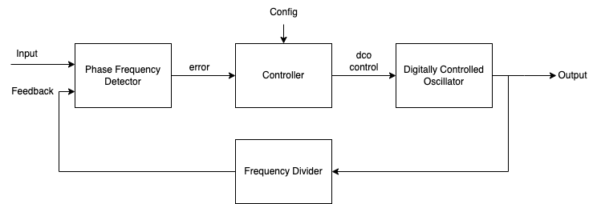
   
   Basic PLL Block Diagram

xcore-ai devices have on-chip a secondary PLL sometimes known as the Application PLL. This PLL
multiplies the clock from the on-board crystal source and has a fractional register allowing very fine control
over the multiplication and division ratios from software.

However, it does not support an external reference clock input and so cannot natively track and lock
to an external clock reference. This software PLL module provides a set of scripts and firmware which enables the
provision of an input reference clock which, along with a control loop, allows tracking of the external reference
over a certain range. It also provides a lower level API to allow tracking of virtual clocks rather than
physical signals such as when receiving digital samples from another device or packets over a network.

There are two types of PLL, or specifically Digitally Controlled Oscillators (DCO), supported in this library.
There are trade-offs between the two types of DCO which are summarised in the following table.

.. list-table:: LUT vs SDM DCO trade-offs
   :widths: 15 30 30
   :header-rows: 1

   * - Comparison item
     - LUT DCO
     - SDM DCO
   * - Jitter
     - Low, 1-2 ns
     - Very Low, 10-50 ps
   * - Memory Usage
     - Low, ~2.5 kB
     - Low,  ~2 kB
   * - MIPS Usage
     - Low - ~1
     - High - ~50
   * - Lock Range PPM
     - Moderate, 100-1000
     - Wide, 1500-3000

.. note::
    Jitter is measured using a frequency mask of 100 Hz to 40 kHz as specified by AES-12id-2006.

A fixed (non phase-locked) PLL setup API is also available which assumes a 24 MHz XTAL frequency and provides output
frequencies of 11.2896 MHz, 12.288 MHz, 22.5792 MHz, 24.576 MHz, 45.1584 MHz or 49.152 MHz. Output jitter for
fixed clocks using a 100 Hz to 40 kHz mask is typically less than 8 ps. See the `Common API`_ section.

LUT based DCO
-------------

The LUT based DCO allows a discrete set of fractional settings resulting in a fixed number of frequency steps. 
The LUT is pre-computed table which provides a set of monotonically increasing frequency register settings. The LUT
based DCO requires very low compute allowing it to be run in a sample-based loop at audio
frequencies such as 48kHz or 44.1kHz. It required two bytes per LUT entry and provides reasonable
jitter performance suitable for voice or entry level Hi-Fi.

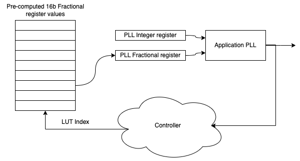
   
   LUT DCO based PLL

The range is governed by the look up table (LUT) which has a finite number of entries and consequently
has a frequency step size. This affects the output jitter performance when the controller oscillates between two
settings once locked. Note that the actual range and number of steps is highly configurable. 

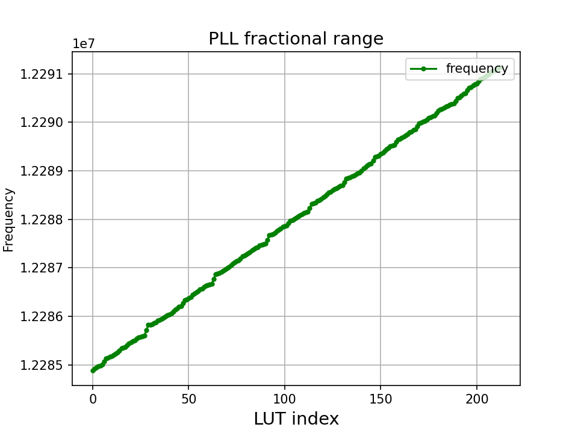
   
   Example of LUT Discrete Output Frequencies

The index into the LUT is controlled by a 
PI controller which multiplies the error input and integral error input by the supplied loop constants.
An integrated `wind up` limiter for the integral term is nominally set at 2x the maximum LUT index
deviation to prevent excessive overshoot where the starting input error is high. A double integrator term
is also available to help zero phase error.

A time domain plot of how the controller (typically running at around 100 Hz) selects between adjacent 
LUT entries, and the consequential frequency modulation effect, can be seen in the following diagrams.

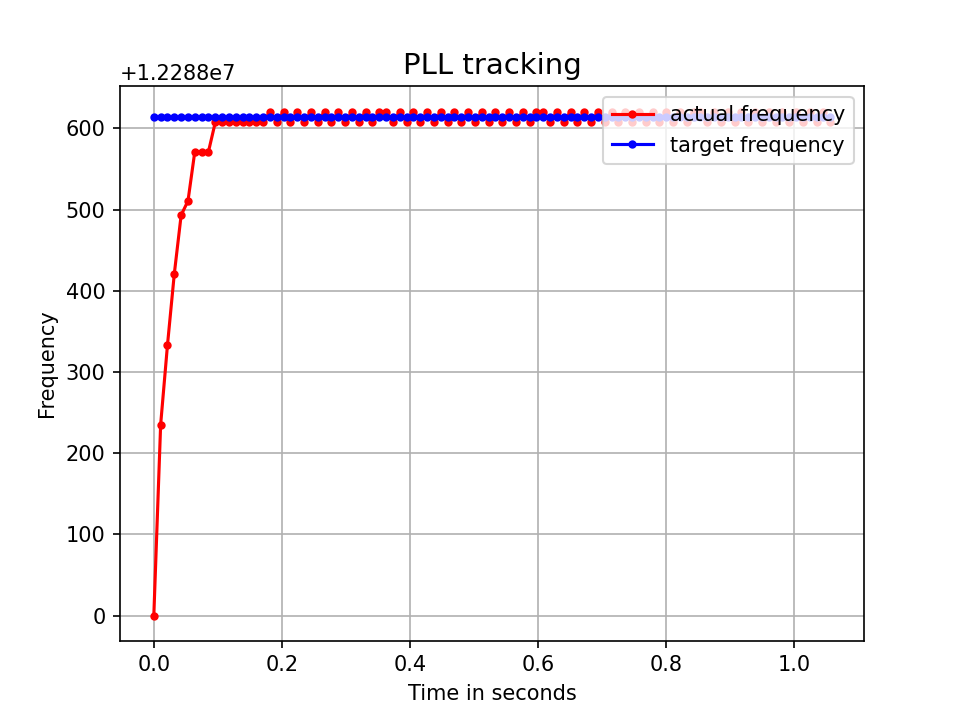
   
   LUT selection when tracking a constant input frequency

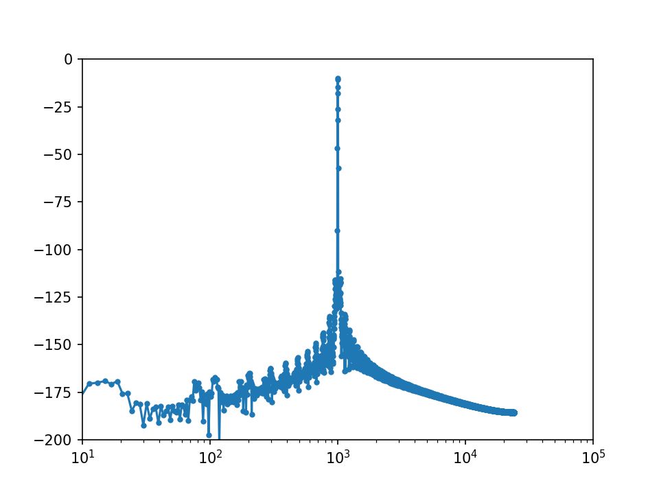
   
   LUT noise plot when when tracking a constant input frequency

SDM Based DCO
-------------

The SDM based DCO provides a fixed number (9 in this case) of frequency steps which are jumped between
at a high rate (eg. 1 MHz) but requires a dedicated logical core to run the SDM algorithm and update the PLL
fractional register. The SDM is third order.

The SDM typically provides better audio quality by pushing the noise floor up into the
inaudible part of the spectrum. A fixed set of SDM coefficients and loop filters are provided which
have been hand tuned to provide either 24.576 MHz or 22.5792 MHz low jitter clocks and are suitable for Hi-Fi 
and professional audio applications.

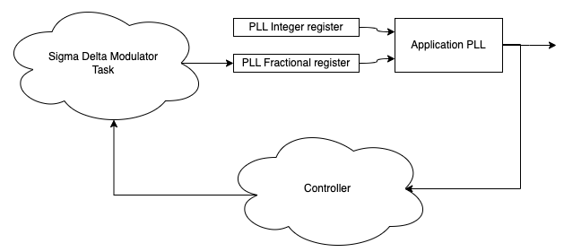
   
   SDM DCO based PLL

The steps for the SDM output are quite large which means a wide range is typically available.

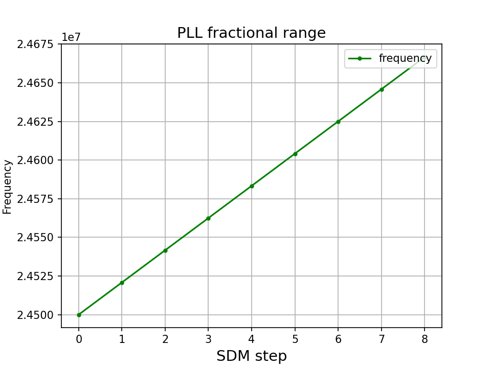
   
   SDM discrete output frequencies

A time domain plot of how the Sigma Delta Modulator jumps rapidly between multiple frequencies and the consequential 
spread of the noise floor can be seen in the following diagrams.

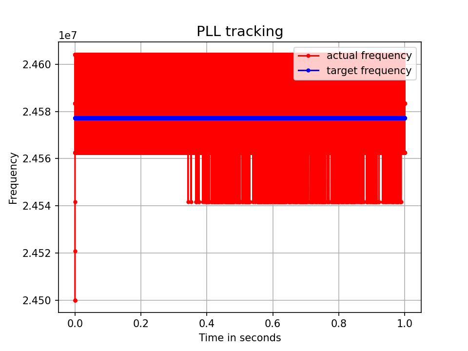
   
   SDM frequency selection when tracking a constant input frequency

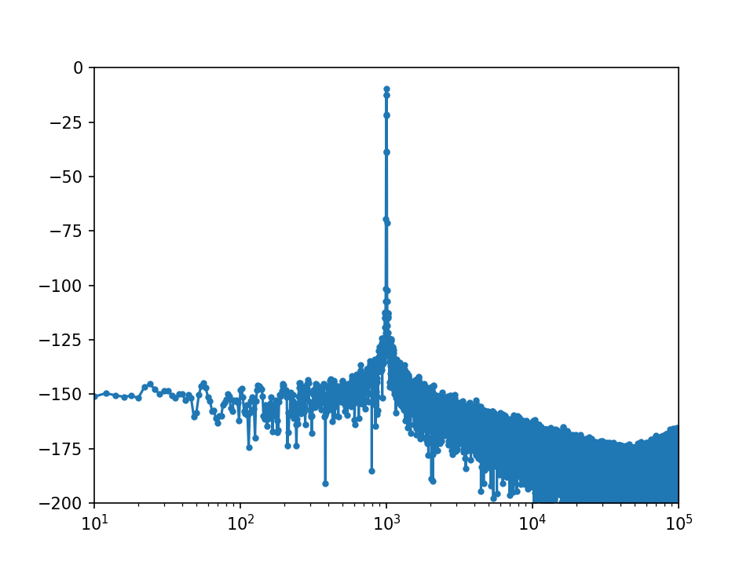
   
   SDM noise plot when when tracking a constant input frequency

Phase Frequency Detector
------------------------

The Software PLL PFD detects frequency by counting clocks over a specific time period. The clock counted is the output from the PLL and the
time period over which the count happens is a multiple of the input reference clock. This way the frequency difference between the 
input and output clock can be directly measured by comparing the read count increment with the expected count increment for the 
nominal case where the input and output are locked. 

The PFD cannot directly measure phase, however, by taking the time integral of the frequency we can derive the phase which can be done
by the PI controller.

The PFD uses three chip resources:

- A one bit port to capture the PLL output clock (always Port 1D on Tile[1] of xcore-ai)
- A clock block to turn the captured PLL output clock into a signal which can be distributed across the xcore tile
- An input port (either one already in use or an unconnected dummy port such as Port 32A) clocked from the above clock block. The in-built counter of this port
  can then be read and provides a count of the PLL output clock.

Two diagrams showing practical xcore resource setups are shown in the `Example Application Resource Setup`_ section.

The port timers are 16 bits and so the PFD must account for wrapping because the overflow period at, for example, 24.576 MHz
is 2.67 milliseconds and a typical control period is in the order 10 milliseconds.

There may be cases where the port timer sampling time cannot be guaranteed to be fully isochronous, such as when a significant number of
instructions exist between a hardware event occur between the reference clock transition and the port timer sampling. In these cases
an optional input jitter reduction scheme is provided allow scaling of the read port timer value. This scheme is used in the ``i2s_slave_lut`` 
example where the port timer read is precisely delayed until the transition of the next BCLK which removes the instruction timing jitter
that would otherwise be present. The cost is 1/64th of LR clock time of lost processing in the I2S callbacks but the benefit is the jitter
caused by variable instruction timing to be eliminated.

Proportional Integral Controller
--------------------------------

The PI controller uses fixed point (15Q16) types and 64 bit intermediate terms to calculate the error and accumulated error which are summed to produce the
output. In addition a double integral term is included to allow calculation of the integral term of phase error, which itself 
is the integral of the frequency error which is the output from the PFD.

Wind-up protection is included in the PI controller which clips the integral and double integral accumulator terms and is nominally 
set to LUT size for the LUT based DCO and the control range for the SDM based DCO.

The SDM controller also includes a low-pass filter for additional error input jitter reduction.

See the `Tuning the Software PLL`_ section for information about how to optimise the PI controller.

Simulation Model
================

A complete model of the Software PLL is provided and is written in Python version 3.

Contents
--------

In the ``python/sw_pll`` directory you will find multiple files::

    .
    ├── analysis_tools.py
    ├── app_pll_model.py
    ├── controller_model.py
    ├── dco_model.py
    ├── pfd_model.py
    ├── pll_calc.py
    └── sw_pll_sim.py

These are all installable as a Python PIP module by running ``pip install -e .`` from the root of the repo.

Typically you do not need to access any file other than ``sw_pll_sim.py`` which brings in the other files as modules when run.
 ``sw_pll_sim.py`` may be run with the argument ``LUT`` or ``SDM`` depending on which type of PLL you wish to simulate.

``analysis_tools.py`` contains audio analysis tools for assessing the frequency modulation of a tone from the jitter in
the recovered clock.

``controller_model.py`` models the PI controllers used in the Software PLL system.

``dco_model.py`` contains a model of the LUT and SDM digitally controlled oscillators.

``pfd_model.py`` models the Phase Frequency Detector which is used when inputting a reference clock to the Software PLL.

``app_pll_model.py`` models the Application PLL hardware and allows reading/writing include files suitable for inclusion into xcore
firmware projects.

``pll_calc.py`` is the command line script that generates the LUT. It is quite a complex to use script which requires in depth
knowledge of the operation of the App PLL. Instead it is recommended to use ``app_pll_model.py`` which calls ``pll_calc.py`` which
wraps the script with sensible defaults, or better, use one of the provided profiles driven by ``sw_pll_sim.py``.

Running the PI simulation and LUT generation script
---------------------------------------------------

By running ``sw_pll_sim.py LUT`` a number of operations will take place:

 - The ``fractions.h`` LUT include file will be generated (LUT PLL only - this is not needed by SDM)
 - The ``register_setup.h`` PLL configuration file will be generated for inclusion in your xcore project.
 - A graphical view of the LUT settings showing index vs. output frequency is generated.
 - A time domain simulation of the PI loop showing the response to steps and out of range reference inputs is run.
 - A wave file containing a 1 kHz modulated tone for offline analysis.
 - A log FFT plot of the 1 kHz tone to see how the PLL frequency steps affect a pure tone.
 - A summary report of the PLL range is also printed to the console.

The directory listing following running of ``sw_pll_sim.py`` will be added to as follows::

    .
    ├── fractions.h
    ├── register_setup.h
    ├── tracking_lut.png
    ├── tracking_sdm.png
    ├── modulated_tone_1000Hz_lut.wav
    ├── modulated_tone_1000Hz_sdm.wav
    ├── modulated_fft_lut.png
    └── modulated_fft_sdm.png

Below you can see the step response of the control loop when the target frequency is changed during the simulation.
You can see it track smaller step changes but for the
larger steps it can be seen to clip and not reach the input step, which is larger than the used LUT size will 
allow. The LUT size can be increased if needed to accommodate a wider range.

The step response is quite fast and you can see even a very sharp change in frequency is accommodated in just
a handful of control loop iterations.

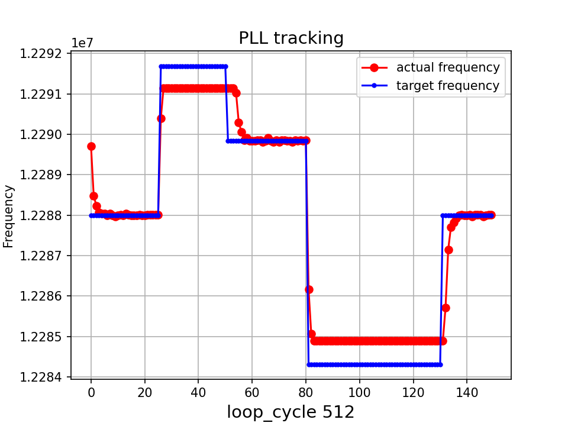

Tuning the Software PLL
=======================

LUT based PLL Tuning
--------------------

PI controller
.............

Typically the PID loop tuning should start with 0 *Kp* term and a small (e.g. 1.0) *Ki* term.
 
 - Decreasing the ref_to_loop_call_rate parameter will cause the control loop to execute more frequently and larger constants will be needed.
 - Try tuning *Ki* value until the desired response curve (settling time, overshoot etc.) is achieved in the ``tracking_xxx.png`` output.
 - *Kp* can normally remain zero, but you may wish to add a small value to improve step response

.. note::
    After changing the configuration, ensure you delete `fractions.h` otherwise the script will re-use the last calculated values. This is done to speed execution time of the script by avoiding the generation step.

A double integral term is supported in the PI loop because the the clock counting PFD included measures
the frequency error. The phase error is the integral of the frequency error and hence if phase locking
is required as well as frequency locking then we need to support the integral of the integral of 
the frequency error.  Changing the Kp, Ki and Kii constants and observing the simulated (or hardware response)
to a reference change is all that is needed in this case.

.. note::
    In the python simulation file ``sw_pll_sim.py``, the PI constants *Kp*, *Ki* and optionally *Kii* can be found in the functions `run_lut_sw_pll_sim()` and `run_sd_sw_pll_sim()`.

Typically a small Kii term is used, if needed, because it accumulates very quickly.

LUT Example Configurations
..........................

The LUT implementation requires an offline generation stage which has many possibilities for customisation. 

A number of example configurations, which demonstrate the effect on PPM, step size etc. of changing various parameters, is provided in the ``sw_pll_sim.py`` file.
Search for ``profiles`` and ``profile_choice`` in this file. Change profile choice index to select the different example profiles and run the python file again.

.. list-table:: Example LUT DCO configurations
   :widths: 50 50 50 50 50
   :header-rows: 1

   * - Output frequency MHz
     - Reference frequency kHz
     - Range +/- PPM
     - Average step size Hz
     - LUT size bytes
   * - 12.288
     - 48.0
     - 250
     - 29.3
     - 426
   * - 12.288
     - 48.0
     - 500
     - 30.4
     - 826
   * - 12.288
     - 48.0
     - 1000
     - 31.0
     - 1580
   * - 24.576
     - 48.0
     - 500
     - 60.8
     - 826
   * - 24.576
     - 48.0
     - 100
     - 9.5
     - 1050
   * - 6.144
     - 16.0
     - 150
     - 30.2
     - 166

.. note::
    The physical PLL actually multiplies the input crystal, not the reference input clock. 
    It is the PFD and software control loop that detects the frequency error and controls the fractional register to make the PLL track the input.
    A change in the reference input clock parameter only affects the control loop and its associated constants such as how often the PI controller is called.

Custom LUT Generation Guidance
..............................

The fractions lookup table is a trade-off between PPM range and frequency step size. Frequency 
step size will affect jitter amplitude as it is the amount that the PLL will change frequency when it needs 
to adjust. Typically, the locked control loop will slowly oscillate between two values that 
straddle the target frequency, depending on input frequency.

Small discontinuities in the LUT may be experienced in certain ranges, particularly close to 0.5 fractional values, so it is preferable 
to keep in the lower or upper half of the fractional range. However the LUT table is always monotonic 
and so control instability will not occur for that reason. The range of the LUT Software PLL can be seen 
in the ``lut_dco_range.png`` image. It should be a reasonably linear response without significant 
discontinuities. If discontinuities are seen, try moving the range towards 0.0 or 1.0 where fewer discontinuities may
be observed due the step in the fractions.

Steps to vary the LUT PPM range and frequency step size
.......................................................

1. Ascertain your target PPM range, step size and maximum tolerable table size. Each lookup value is 16 bits so the total size in bytes is 2 * n.
2. Start with the given example values and run the generator to see if the above three parameters meet your needs. The values are reported by ``sw_pll_sim.py``.
3. If you need to increase the PPM range, you may either:
    - Decrease the ``min_F`` to allow the fractional value to have a greater effect. This will also increase step size. It will not affect the LUT size.
    - Increase the range of ``fracmin`` and ``fracmax``. Try to keep the range closer to 0 or 1.0. This will decrease step size and increase LUT size.
4. If you need to decrease the step size you may either:
    - Increase the ``min_F`` to allow the fractional value to have a greater effect. This will also reduce the PPM range. When the generation script is run the allowable F values are reported so you can tune the ``min_F`` to force use of a higher F value.
    - Increase the ``max_denom`` beyond 80. This will increase the LUT size (finer step resolution) but not affect the PPM range. Note this will increase the intrinsic jitter of the PLL hardware on chip due to the way the fractional divider works. 80 has been chosen for a reasonable tradeoff between step size and PLL intrinsic jitter and pushes this jitter beyond 40 kHz which is out of the audio band. The lowest intrinsic fractional PLL jitter freq is input frequency (normally 24 MHz) / ref divider / largest value of n.
5. If the +/-PPM range is not symmetrical and you wish it to be, then adjust the ``fracmin`` and ``fracmax`` values around the center point that the PLL finder algorithm has found. For example if the -PPM range is to great, increase ``fracmin`` and if the +PPM range is too great, decrease the ``fracmax`` value.

.. note::
    When the process has completed, please inspect the ``lut_dco_range.png`` output figure which shows how the fractional PLL setting affects the output frequency.
    This should be monotonic and not contain an significant discontinuities for the control loop to operate satisfactorily.

SDM based PLL Tuning
--------------------

SDM Available Configurations
............................

The SDM implementation only allows tuning of the PI loop; the DCO section is hand optimised for the provided profiles shown
below. There are two target PLL output frequencies and two options for SDM update rate depending on how much performance
is available from the SDM task.

.. list-table:: SDM DCO configurations
   :widths: 50 50 50 50 50
   :header-rows: 1

   * - Output frequency MHz
     - Range +/- PPM
     - Jitter ps
     - Noise Floor dBc
     - SDM update rate kHz
   * - 24.576
     - 3000
     - 10
     - -100
     - 1000
   * - 22.5792
     - 3300
     - 10
     - -100
     - 1000
   * - 24.576
     - 1500
     - 50
     - -93
     - 500
   * - 22.5792
     - 1500
     - 50
     - -93
     - 500

The SDM based DCO Software PLL has been pre-tuned and should not need modification in normal circumstances. Due to the large control range values
needed by the SDM DCO, a relatively large integral term is used which applies a gain term. If you do need to tune the SDM DCO PI controller then
it is recommended to start with the provided values in the example in ``/examples/simple_sdm``.

Transferring the results to C
-----------------------------

Once the LUT has been generated or SDM profile selected and has simulated in Python, the values can be transferred to the firmware application. Control loop constants
can be directly transferred to the `init()` functions and the generated `.h` files can be copied directly into the source directory
of your project.

For further information, either consult the ``sw_pll.h`` API file (included at the end of this document) or follow one of the examples in the ``/examples`` directory.

Example Application Resource Setup
==================================

The xcore-ai device has a number of resources on chip which can be connected together to manage signals and application clocks.
In the provided examples both `clock blocks` and `ports` are connected together to provide an input to
the PFD which calculates frequency error. Resources are additionally provide an optional prescaled output clock for comparison with the input reference.

Simple Example Resource Setup
-----------------------------

The output from the PLL is counted using a port timer via the `clk_mclk` clock block.

In addition, a precise timing barrier is implemented by clocking a dummy port from the clock block
clocked by the reference clock input. This provides a precise sampling point of the PLL output clock count.

The resource setup code is contained in ``resource_setup.h`` and ``resource_setup.c`` using intrinsic functions in ``lib_xcore``.
To help visualise how these resources work together, please see the below diagram.

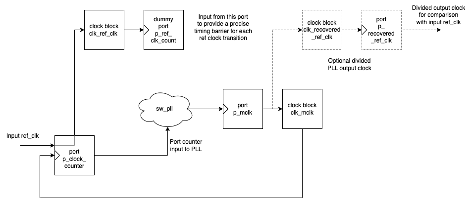
   
   Use of Ports and Clock Blocks in the Simple Examples

I2S Slave Example Resource Setup
--------------------------------

The I2S slave component already uses a clock block which captures the bit clock input. In addition to this,
the PLL output is used to clock a dummy port's counter which is used as the input to the PFD.

Since the precise sampling time of the PLL output clock count is variable due to instruction timing between
the I2S LRCLK transition and the capture of the PLL output clock count in the I2S callback, an additional dummy port is used.
This precisely synchronises the capture of the PLL output clock count relative to the BCLK transition and
the relationship between these is used to reconstruct the absolute frequency difference with minimal input jitter.

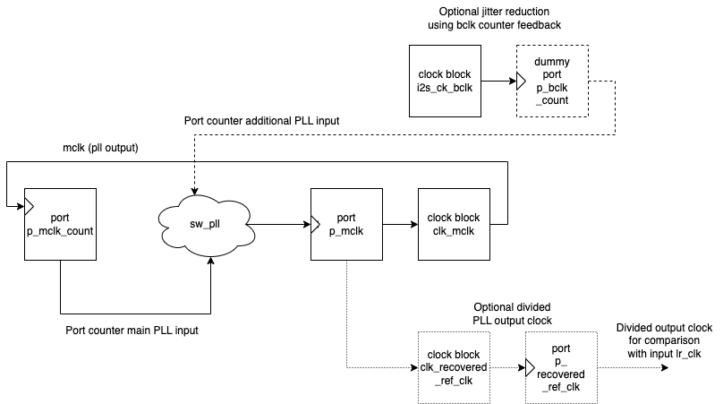
   
   Use of Ports and Clock Blocks in the I2S Slave Example

Software PLL API
================

The Application Programmer Interface (API) for the Software PLL is shown below. It is split into items specific to LUT and SDM DCOs .

In addition to the standard API which takes a clock counting input (implements the PFD), for applications where the PLL is 
to be controlled using an alternatively derived error input, a low-level API is also provided. This low-level
API allows the Software PLL to track an arbitrary clock source which is calculated by another means such as timing of received packets
over a communications interface.

LUT Based PLL API
----------------- 

The LUT based API are functions designed to be called from an audio loop. Typically the functions can take up to 210 instruction cycles when control occurs and just a few 10s of cycles when control does not occur. If run at a rate of 48 kHz then it will consume approximately 1 MIPS on average.

.. doxygengroup:: sw_pll_lut
    :content-only:

SDM Based PLL API
-----------------

All SDM API items are function calls. The SDM API requires a dedicated logical core to perform the SDM calculation and periodic register write and it is expected that the user provide the fork (par) and call to the SDM.

A typical design idiom is to have the task running in a loop with a timing barrier (either 1 us or 2 us depending on profile used) and a non-blocking channel poll which allows new DCO control values to be received as needed at the control loop rate. The SDM calculation and register write takes 45 instruction cycles and so with the overheads of the timing barrier and the non-blocking channel receive poll, a minimum 60 MHz logical core should be set aside for the SDM task running at 1 us period. 
This can be approximately halved it running at 2 us SDM period.

The control part of the SDM SW PLL takes 75 instruction cycles when active and a few 10 s of cycles when inactive so you will need to budget around 1 MIPS for this when
being called at 48 kHz with a control rate of one in every 512 cycles.

An example of how to implement the threading, timing barrier and non-blocking channel poll can be found in ``examples/simple_sdm/simple_sw_pll_sdm.c``. A thread diagram of how this can look is shown below. 

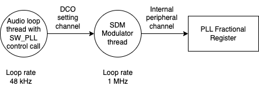
   
   Example Thread Diagram of SDM SW PLL

.. doxygengroup:: sw_pll_sdm
    :content-only:

Common API
----------

.. doxygengroup:: sw_pll_common
    :content-only:

