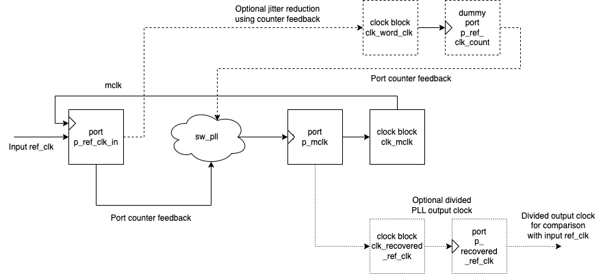

How the Software PLL works
--------------------------

A Phase Locked Loop (PLL) is a typically hardware that allows generation of a clock which is synchronised
to an input reference clock by both phase and frequency. They consist of a number of sub-components:

 - A Phase Frequency Detector (PFD) which measures the difference (error) between a reference clock and the divided generated clock.
 - A control loop, typically a Proportional Integral (PI) controller to close the loop and zero the error.
 - A Digitally Controlled Oscillator (DCO) which converts a control signal into a clock frequency.

.. figure:: ./images/PLL_block_diagram.png
   :width: 100%
   
   Basic PLL Block Diagram

xcore-ai devices have on-chip a secondary PLL sometimes known as the Application PLL. This PLL
multiplies the clock from the on-board crystal source and has a fractional register allowing very fine control
over the multiplication and division ratios from software.

However, it does not support an external reference clock input and so cannot natively track and lock
to an external clock reference. This software PLL module provides a set of scripts and firmware which enables the
provision of an input reference clock which, along with a control loop, allows tracking of the external reference
over a certain range. It also provides a lower level API to allow tracking of virtual clocks rather than
physical signals.

There are two types of PLL, or specifically Digitally Controlled Oscillators (DCO), supported in this library.

LUT based DCO
.............

The LUT based DCO allows a discrete set of fractional settings resulting in a fixed number of frequency steps. 
The LUT is pre-computed table which provides a set of monotonic increasing frequency register settings. The LUT
based DCO requires very low compute allowing it to be run in a sample-based loop at audio
frequencies such as 48kHz or 44.1kHz. It required two bytes per LUT entry. It provides reasonable
jitter performance suitable for voice or entry level Hi-Fi.

.. figure:: ./images/lut_pll.png
   :width: 100%
   
   LUT DCO based PLL

The range is governed by the look up table (LUT) which has a finite number of entries and consequently
a step size which affects the output jitter performance when the controller oscillates between two
settings once locked. Note that the actual range and number of steps is highly configurable. 

.. figure:: ./images/lut_dco_range.png
   :width: 100%
   
   LUT discrete output frequencies

The index into the LUT is controlled by a 
PI controller which multiplies the error in put and integral error input by the supplied loop constants.
An integrated `wind up` limiter for the integral term is nominally set at 2x the maximum LUT index
deviation to prevent excessive overshoot where the starting input error is high.

A time domain plot of how the controller (typically running at around 100 Hz) selects between adjacent 
LUT entries, and the consequential frequency modulation effect, can be seen in the following diagrams.

.. figure:: ./images/tracking_lut.png
   :width: 100%
   
   LUT selection when tracking a constant input frequency

.. figure:: ./images/modulated_fft_lut.png
   :width: 100%
   
   LUT noise plot when when tracking a constant input frequency

SDM Based DCO
.............

The SDM based DCO provides a fixed number (9 in this case) of frequency steps which are jumped between
at a high rate (eg. 1 MHz) but requires a dedicated logical core to run the SDM algorithm and update the PLL
fractional register. The SDM is third order.

The SDM typically provides better audio quality by pushing the noise floor up into the
inaudible part of the spectrum. A fixed set of SDM coefficients and loop filters are provided which
have been hand tuned to provide either 24.576 MHz or 22.5792 MHz low jitter clocks and are suitable for Hi-Fi systems
and professional audio applications.

.. figure:: ./images/sdm_pll.png
   :width: 100%
   
   SDM DCO based PLL

The steps for the SDM output are quite large which means a wide range is typically available.

.. figure:: ./images/sdm_dco_range.png
   :width: 100%
   
   SDM discrete output frequencies

A time domain plot of how the Sigma Delta Modulator jumps rapidly between multiple frequencies and the consequential 
spread of the noise floor can be seen in the following diagrams.

.. figure:: ./images/tracking_sdm.png
   :width: 100%
   
   SDM frequency selection when tracking a constant input frequency

.. figure:: ./images/modulated_fft_sdm.png
   :width: 100%
   
   SDM noise plot when when tracking a constant input frequency

There are trade-offs between the two types of DCO which are summarised in the following table.

.. list-table:: LUT vs SDM DCO trade-offs
   :widths: 15 30 30
   :header-rows: 1

   * - Comparison item
     - LUT DCO
     - SDM DCO
   * - Jitter
     - Low - ~1-2 ns
     - Very Low - ~10-50 ps
   * - Memory Usage
     - Moderate - 3 kB
     - Low - 1 kB
   * - MIPS Usage
     - Low - ~1
     - High - ~50
   * - Lock Range PPM
     - Moderate - 100-1000
     - Wide - 1500-3000

Controller API Notes
....................

In addition to the standard API which takes a clock counting input, for applications where the PLL is 
to be controlled using a PI fed with a raw error input, a low-level API is also provided. This low-level
API allows the Software PLL to track an arbitrary clock source which is calculated by another means.

This document provides a guide to generating the LUT and configuring the available parameters to
reach the appropriate compromise of performance and resource usage for your application.

Steps to tune the PI loop
-------------------------

Note, in the python simulation file ``sw_pll_sim.py``, the PI constants *Kp* and *Ki* can be found in the function `run_sim()`.

Typically the PID loop tuning should start with 0 *Kp* term and a small (e.g. 1.0) *Ki* term.
 
 - Decreasing the ref_to_loop_call_rate parameter will cause the control loop to execute more frequently and larger constants will be needed.
 - Try tuning *Ki* value until the desired response curve (settling time, overshoot etc.) is achieved in the ``pll_step_response.png`` output.
 - *Kp* can normally remain zero, but you may wish to add a small value to improve step response

.. note::
    After changing the configuration, ensure you delete `fractions.h` otherwise the script will re-use the last calculated values. This is done to speed execution time of the script by avoiding the generation step.

A double integral term is supported in the PI loop because the the clock counting PFD included measures
the frequency error. The phase error is the integral of the frequency error and hence if phase locking
is required as well as frequency locking then we need to support the intergral of the integral of 
the frequency error. Simply changing the Kp, Ki and Kii constants is all that is needed in this case.

Typically a small Kii term is used if needed because it accumulates very quickily.

Running the PI simulation and LUT generation script
---------------------------------------------------

In the ``python/sw_pll`` directory you will find multiple files::

    .
    ├── analysis_tools.py
    ├── app_pll_model.py
    ├── controller_model.py
    ├── dco_model.py
    ├── pfd_model.py
    ├── pll_calc.py
    └── sw_pll_sim.py

``pll_calc.py`` is the command line script that generates the LUT. It is quite a complex to use script which requires in depth
knowledge of the operation of the App PLL. Instead, it is recommended to use ``sw_pll_sim.py`` which calls ``pll_calc.py`` 
except with a number of example PLL profiles already provided as a starting point.

By running `sw_pll_sim.py` a number of operations will take place:

 - The ``fractions.h`` LUT include file will be generated.
 - The ``register_setup.h`` PLL configuration file will be generated.
 - A graphical view of the LUT settings ``sw_pll_range.png`` showing index vs. output frequency is generated.
 - A time domain simulation of the PI loop showing the response to steps and out of range reference inputs is run.
 - A graphical view of the simulation is saved to ``pll_step_response.png``.
 - A wave file containing a 1 kHz modulated tone for offline analysis. Note that ``ppm_shifts`` will need to be set to ``()`` otherwise it will contain the injected PPM deviations as part of the step response test.
 - A zoomed-in log FFT plot of the 1 kHz tone to see how the LUT frequency steps affect a pure tone. The same note applies as the above item.
 - A summary report of the PLL range is printed to the console.

The directory listing following running of ``sw_pll_sim.py`` should look as follows::

    .
    ├── fractions.h
    ├── pll_calc.py
    ├── pll_step_response.png
    ├── register_setup.h
    ├── sw_pll_range.png
    ├── modulated_tone_1000Hz.wav
    ├── modulated_tone_fft_1000Hz.png
    └── sw_pll_sim.py

A typical LUT transfer function is shown below. Note that although not perfectly regular it is monotonic and hence
the control loop will work well with it. This is an artifact of the fractional setting steps available.
You can also see the actual frequency oscillate very slightly over time. This is because the control loop hunts
between two discrete fractional settings in the LUT and is expected. You may adjust the rate at which the control
loop is called to center this noise around different frequencies or decrease the step size (larger LUT) to
manage the amplitude of this artifact.

Here you can see the step response of the control loop below. You can see it track smaller step changes but for the
larger steps it can be seen to clip and not reach the input step, which is larger than the LUT size will 
allow. The LUT size can be increased if needed to accommodate a wider range.

The step response is quite fast and you can see even a very sharp change in frequency is accommodated in just
a handful of control loop iterations.

.. image:: ./images/pll_step_response.png
   :width: 100%

Note that each time you run ``sw_pll_sim.py`` and the ``fractions.h`` file is produced, a short report will be produced that indicates the achieved range of settings.
Below is a typical report showing what information is summarised::

    $ rm -f fractions.h  && python sw_pll_sim.py 
    Running: lib_sw_pll/python/sw_pll/pll_calc.py -i 24.0  -a -m 80 -t 12.288 -p 6.0 -e 5 -r --fracmin 0.695 --fracmax 0.905 --header
    Available F values: [30, 32, 77, 79, 116, 118, 122, 159, 163, 165, 200, 204, 208, 245, 286, 331, 417]
    output_frequency: 12288000.0, vco_freq: 2457600000.0, F: 203, R: 1, f: 3, p: 4, OD: 1, ACD: 24, ppm: 0.0
    PLL register settings F: 203, R: 1, OD: 1, ACD: 24, f: 3, p: 4
    min_freq: 12281739Hz
    mid_freq: 12288000Hz
    max_freq: 12294286Hz
    average step size: 30.3791Hz, PPM: 2.47226
    PPM range: -509.771
    PPM range: +511.533
    LUT entries: 413 (826 bytes)

The following section provides guidance for adjusting the LUT.

How to configure the LUT fractions table
----------------------------------------

The fractions lookup table is a trade-off between PPM range and frequency step size. Frequency 
step size will affect jitter amplitude as it is the amount that the PLL will change frequency when it needs 
to adjust. Typically, the locked control loop will slowly oscillate between two values that 
straddle the target frequency, depending on input frequency.

Small discontinuities in the LUT may be experienced in certain ranges, particularly close to 0.5 fractional values, so it is preferable 
to keep in the lower or upper half of the fractional range. However the LUT table is always monotonic 
and so control instability will not occur for that reason. The range of the ``sw_pll`` can be seen 
in the ``sw_pll_range.png`` image. It should be a reasonably linear response without significant 
discontinuities. If not, try moving the range towards 0.0 or 1.0 where fewer discontinuities will
be observed.

Steps to vary PPM range and frequency step size
...............................................

1. Ascertain your target PPM range, step size and maximum tolerable table size. Each lookup value is 16b so the total size in bytes is 2 x n.
2. Start with the given example values and run the generator to see if the above three parameters meet your needs. The values are reported by ``sw_pll_sim.py``.
3. If you need to increase the PPM range, you may either:
    - Decrease the ``min_F`` to allow the fractional value to have a greater effect. This will also increase step size. It will not affect the LUT size.
    - Increase the range of ``fracmin`` and ``fracmax``. Try to keep the range closer to 0 or 1.0. This will decrease step size and increase LUT size.
4. If you need to decrease the step size you may either:
    - Increase the ``min_F`` to allow the fractional value to have a greater effect. This will also reduce the PPM range. When the generation script is run the allowable F values are reported so you can tune the ``min_F`` to force use of a higher F value.
    - Increase the ``max_denom`` beyond 80. This will increase the LUT size (finer step resolution) but not affect the PPM range. Note this will increase the intrinsic jitter of the PLL hardware on chip due to the way the fractional divider works. 80 has been chosen for a reasonable tradeoff between step size and PLL intrinsic jitter and pushes this jitter beyond 40 kHz which is out of the audio band. The lowest intrinsic fractional PLL jitter freq is input frequency (normally 24 MHz) / ref divider / largest value of n.
5. If the +/-PPM range is not symmetrical and you wish it to be, then adjust the ``fracmin`` and ``fracmax`` values around the center point that the PLL finder algorithm has found. For example if the -PPM range is to great, increase ``fracmin`` and if the +PPM range is too great, decrease the ``fracmax`` value.

Note when the process has completed, please inspect the ``sw_pll_range.png`` output figure which shows how the fractional PLL setting affects the output frequency.
This should be monotonic and not contain an significant discontinuities for the control loop to operate satisfactorily.

Example configurations
......................

A number of example configurations, which demonstrate the effect on PPM, step size etc. of changing various parameters, is provided in the ``sw_pll_sim.py`` file.
Search for ``profiles`` and ``profile_choice`` in this file. Change profile choice index to select the different example profiles and run the python file again.

.. list-table:: Example LUT DCO configurations
   :widths: 50 50 50 50 50
   :header-rows: 1

   * - Output frequency MHz
     - Reference frequency kHz
     - Range +/- PPM
     - Average step size Hz
     - LUT size bytes
   * - 12.288
     - 48.0
     - 250
     - 29.3
     - 426
   * - 12.288
     - 48.0
     - 500
     - 30.4
     - 826
   * - 12.288
     - 48.0
     - 1000
     - 31.0
     - 1580
   * - 24.576
     - 48.0
     - 500
     - 60.8
     - 826
   * - 24.576
     - 48.0
     - 100
     - 9.5
     - 1050
   * - 6.144
     - 16.0
     - 150
     - 30.2
     - 166

Note that the PLL actually multiplies the input crystal, not the reference input clock. A change in the reference input clock only affects the control loop
and its associated constants such as how often the PI loop is called.

Transferring the results to C
.............................

Once the LUT has been generated and simulated in Python, the values can be transferred to the firmware application. Either consult the ``sw_pll.h`` API file (below) for details or follow one of the examples in the ``/examples`` directory.

Simple Example Resource Setup
-----------------------------

The xcore-ai has a number of resources on chip. In the `simple` examples both clock blocks and ports are connected together to provide an input to
the PDF and provide a scaled output clock. The code is contained in ``resource_setup.h`` and ``resource_setup.c`` using intinsic functions in ``lib_xcore``.
To help visualise how these resources work together, please see the below diagram.

   
   Use of Ports and Clock Blocks in the examples

lib_sw_pll API
--------------

The Application Programmer Interface (API) for the Software PLL is shown below. It is split into common items needed for both LUT and SDM DCOs and items specific to each type of DCO.

LUT Based PLL API
................. 

The LUT based API are functions designed to be called from an audio loop. Typically the functions can take up to 210 instruction cycles when control occurs and just a few 10s of cycles when control does not occur. If run at a rate of 48 kHz then it will consume approximately 1 MIPS.

.. doxygengroup:: sw_pll_lut
    :content-only:

SDM Based PLL API
.................

All SDM API items are function calls. The SDM API requires a dedicated logical core to perform the SDM calculation and it is expected that the user provide the fork (par) and call the SDM in a loop. A typical idiom is to have it running in a loop with a timing barrier (either 1 us or 2 us depending on profile used) and a non-blocking channel poll which allows new DCO control values to be received periodically. The SDM calculation and register write takes 45 instuction cycles and so with the overheads of the timing barrier and the non-blocking channel receive poll, a minimum 60 MHz logical core should be set aside for the SDM task.

The control part of the SDM SW PLL takes 75 instuction cycles when active and a few 10s of cycles when inactive so you will need to budget around 1 MIPS for this.

An example of how to implement the threading, timing barrier and non-blocking channel poll can be found in ``examples/simple_sdm/simple_sw_pll_sdm.c``. A thread diagram of how this can look is shown below. 

.. figure:: ./images/sdm_threads.png
   :width: 100%
   
   Example Thread Diagram of SDM SW PLL

.. doxygengroup:: sw_pll_sdm
    :content-only:

Common API
..........

The common API covers an optional reset of the PI controller only for both LUT and SDM options.

.. doxygengroup:: sw_pll_general
    :content-only: